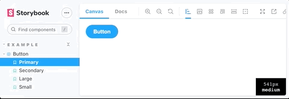

# Storybook Breakpoints Addon

[](https://www.npmjs.com/package/storybook-addon-breakpoints)

A [Storybook](https://storybook.js.org) addon to see the actual width of the Storybook iFrame. If you provide mappings for your breakpoints, we even show you the currently active Breakpoint name 🤗



## Installation

```bash
npm install --save-dev storybook-addon-breakpoints
```

within [`.storybook/main.js`](https://storybook.js.org/docs/react/configure/overview#configure-your-storybook-project):

```js
module.exports = {
  addons: ['storybook-addon-breakpoints'],
};
```

## Configuration

### Default configuration

Without any configuration, the addon shows an overlay with the current width of the Storybook component view.

### Breakpoints

You can pass an object with information about your breakpoints. We use this information to show the name of the corresponding breakpoint in the overlay.

To do so, you have to add the breakpoints to the `breakpoints` [parameter](https://storybook.js.org/docs/react/writing-stories/parameters) in your stories like so:

```js
export default {
  title: 'title-of-my-story',
  parameters: {
    breakpoints: {
      breakpointNames: {
        'small': '0',
        'medium': '500',
        'large': '1000'
      }
    }
  }
};
```

To configure the addon for all stories, set the `breakpoints` parameter in [`.storybook/preview.js`](https://storybook.js.org/docs/react/configure/overview#configure-story-rendering):

```js
export const parameters = {
  breakpoints: {
    breakpointNames: {
      'small': '0',
      'medium': '500',
      'large': '1000'
    }
  }
};
```

The keys of the object `breakpointNames` are the names that we show in the overlay. The corresponding values represent the lower starting point of each breakpoint. In the example above, this means the following:
- small breakpoint: from 0 to 499 pixels
- medium breakpoint: from 500 to 999 pixels
- large breakpoint: from 1000 pixels on

### Debouncing

It can be ressource intensive to make the calculations to display the breakpoints on every pixel resize. To improve performance, we support debouncing on window resize. Use to `debounceTimeout` key as follows:

```js
export const parameters = {
  breakpoints: {
    breakpointNames: {...},
    debounceTimeout: 200
  }
};
```

In the example above, we make the calculations for the breakpoints at maximum every 200ms on resize.
